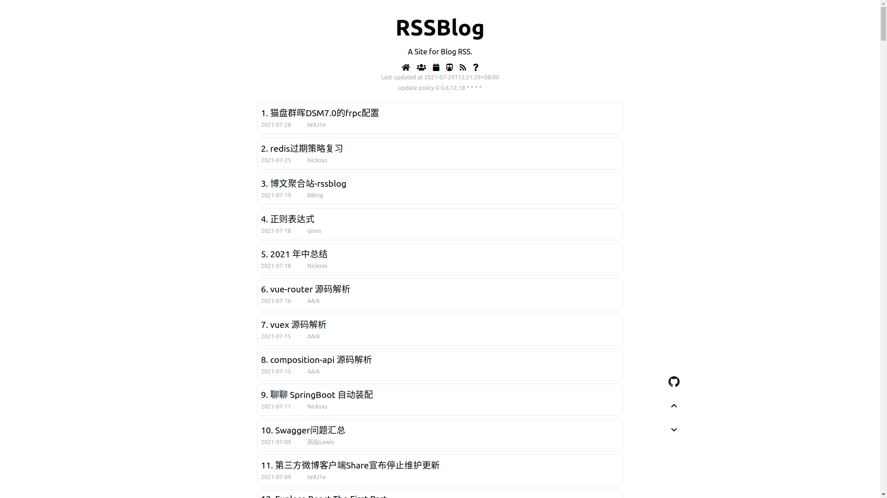

## RSSBlog



RSSBlog 是一个基于RSS的博客内容聚合站. 想法来源: [https://github.com/volfclub/travellings](https://github.com/volfclub/travellings) 及 [https://front-end-rss.vercel.app/](https://front-end-rss.vercel.app/)

### 定位

这是一个值得一直思考的问题.

当初打算写RSSBlog是因为在个人博客添加友链时遇到了一些问题: **被关注的友链, 如何才能比较及时的知道对方有没有更新博文呢?**

或许可以通过爬虫或者其他RSS订阅, 但是最终还是期望把友链的最新内容可以通过博客本站访问到, 所以就搭建了RSSBlog. 所以在最初的版本中, 一直只维护部分友链中的RSS订阅, 再到后来偏移了最初的方向.

最近做了一次更新, 保持原来的url不变, 原始链接依然可以访问所有的订阅. 添加了新的访问方式```/uid/```, 通过uid访问, 可以定制不同的RSS列表. 比如可以将我的博客友链列表做成一个json文件, 然后接入到RSSBlog, 假设uid是bbing, 那么就可以通过[https://rssblog.cn/bbing](https://rssblog.cn/bbing)访问到我定制的RSS列表, 将这个链接接入到个人博客, 就可以比较及时的获取友链更新的情况.

### 接入规则

#### 加入RSSBlog的博客应满足

1. 愿为开放的网络做出贡献(如乐于分享知识经验等)
2. 没有违法以及影响体验的内容(如侵入式广告等)
3. 正常更新维护中(国内无法正常访问会被移除)
4. 网页已有较多内容
5. 启用https

#### 提交issue

如果满足RSSBlog的接入条件, 且期望接入RSSBlog, 需要按照以下格式提交[issue](https://github.com/caibingcheng/rssblog/issues):
```
{
    "uid" :　"gist json link",
}
```
例如:
```
{
    "bbing": "https://gist.githubusercontent.com/caibingcheng/adf8f300dc50a61a965bdcc6ef0aecb3/raw/friends.json",
}
```
提交的[issue](https://github.com/caibingcheng/rssblog/issues)将经过人工筛选, 以保证内容干净.

json的格式可以参考[此处](https://gist.githubusercontent.com/caibingcheng/adf8f300dc50a61a965bdcc6ef0aecb3/raw/friends.json).

#### RSS接力

目前还没有非常确定的定义RSSBlog的接力规则, 所以目前可以您的博客网站中无需有指向RSSBlog的链接, 当然有的话最好了.

您可以在底部或者其他地方接入:
```HTML
<a href="https://rssblog.cn/[uid]" target="_blank" rel="noopener" title="RSSBlog">
    <i class='fas fa-fw fa-inbox'></i>RSSBlog
</a>
```
```fa-inbox```看起来像一个盒子, 比较贴近RSS聚合的定义.

#### TODOLIST

- [ ] 搜索

### UPDATE LIST

- 2021-08-18: 从[RSSBlog-Source](https://github.com/caibingcheng/rssblog-source)获取数据